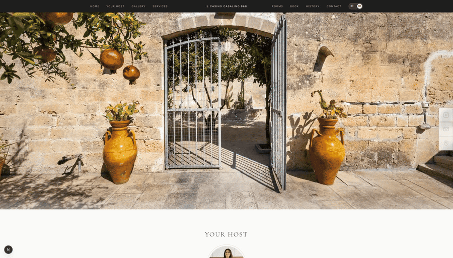

# Il Casino Casalino — B&B website

Single-page site for **Il Casino Casalino**, a four-room B&B in Francavilla Fontana, Puglia.
Built for a client as a front end only: the job was to make the property look as good as it does
in person, load fast on a phone on holiday Wi-Fi, and get a visitor from "this looks nice" to a
confirmed booking without leaving the page.

**Live:** https://www.ilcasinocasalino.com



---

## What it does

**Design first.** A premium-minimal Italian aesthetic — off-white, warm charcoal and stone, Cormorant
Garamond over Inter, generous whitespace and full-bleed imagery. Everything is Tailwind; there are no
component libraries and no template underneath.

**Video of the property, not stock photography.** The site leans on short silent clips — the courtyard,
the pool, breakfast, and three clips per room — because video sells a stay in a way stills don't. The
work was making that cheap to load:

- Source footage (4K HEVC, hundreds of MB) never reaches the repo. `media-originals/` is gitignored, and
  a deterministic transcode step produces web-ready H.264 at a 1280px cap, no audio track, `+faststart`,
  plus a WebP poster for every clip. Every room clip lands under 1 MB.
- `LazyVideo` mounts a `<video>` only for the slide that is **currently active and on screen**. Until then
  the slide is just its poster, so nothing heavy is fetched on first paint and only one clip plays at a time.
- Images are optimised WebP at role-based widths, served through `next/image`.
- `prefers-reduced-motion` is honoured: those visitors get the poster and a play button instead of autoplay.

**Book without leaving the page.** The rooms — Sole, Stella, Venere, Luna — each get their own reel, reached
through an icon selector that doubles as navigation: click a room to jump to it, and the selected icon
re-syncs automatically as you swipe through. Below that, the Holidu booking module is embedded inline, so a
visitor picks dates, sets guests, checks live availability across all four rooms and books in one continuous
scroll. No hand-off to a third-party site mid-decision — which is the whole point.

**Bilingual, resolved server-side.** Italian and English live at `/it` and `/en`. Middleware picks the locale
from a saved cookie, then `Accept-Language`, then falls back to Italian, and redirects before render — so
there's no flash of the wrong language. An explicit locale URL is always served as-is. Captions, alt text and
room names are all translated; the booking widget follows the site's language toggle too.

---

## Stack

- **Next.js 16** (App Router, Turbopack, React Compiler) + **React 19** + **TypeScript**
- **Tailwind CSS v4**
- **Holidu** booking widget for availability and reservations
- **sharp** (images) and **ffmpeg** via `ffmpeg-static` (video) for the media pipeline
- Deployed on **Vercel** — no separate backend

---

## Running it

```bash
npm install
npm run dev          # http://localhost:3000
```

| Script | What it does |
| --- | --- |
| `npm run dev` | Dev server |
| `npm run build` / `npm start` | Production build and serve |
| `npm run typecheck` | `tsc --noEmit` |
| `npm run lint` | ESLint |
| `npm test` | Dependency-free `node --test` suite |
| `npm run media:optimise` | Re-encode images from `media-originals/` → `public/media/images/` |
| `npm run media:optimise:videos` | Re-encode video + posters → `public/media/videos/` |

Both media scripts are idempotent and safe to re-run; they write only into `public/media/`.

---

## Layout

```
src/
├── app/
│   ├── [locale]/            # localised page + layout
│   ├── layout.tsx           # fonts, metadata
│   ├── sitemap.ts, robots.ts
│   └── globals.css
├── components/
│   ├── layout/              # Navbar, MobileMenu, Footer
│   ├── sections/            # Hero, About, Gallery, Services, Rooms, Booking, History, Contact
│   ├── booking/             # HoliduWidget
│   ├── seo/                 # JSON-LD
│   └── ui/                  # MediaCarousel, LazyVideo, RoomSelector, LanguageToggle, FloatingSidebar
├── context/                 # LanguageContext
├── data/media.ts            # localised media metadata — the single source of truth for the galleries
├── lib/                     # holidu, room-nav, locale-detection, scroll, reduced-motion, site
├── translations/            # it.ts, en.ts
└── middleware.ts            # server-side locale redirect
```

The logic worth testing is kept framework-free in `src/lib/` — room↔reel index mapping, locale resolution,
media integrity — and exercised directly by `scripts/*.test.mjs`.
