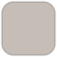
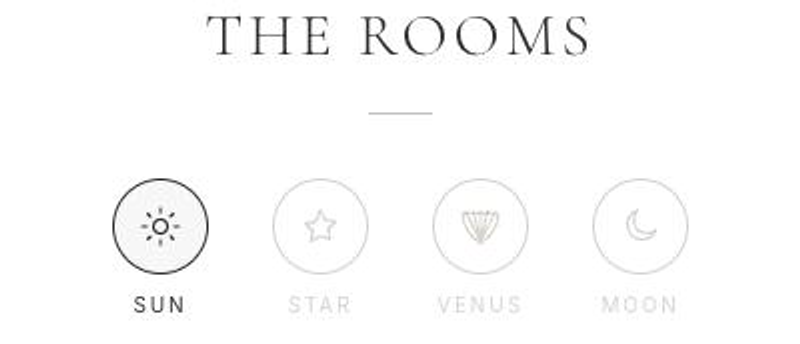

<div align="center">

# Il Casino Casalino

**A four-room B&B in the Puglian countryside — and the website built to fill it.**

[](https://www.ilcasinocasalino.com)


<br>


</div>

---

## The brief

A client front end for a real, working B&B in Francavilla Fontana. No CMS, no admin panel, no
booking engine to maintain — the job was narrower and sharper than that:

> **Make the property look as good as it does in person, load fast on a phone on holiday Wi-Fi,
> and get a visitor from "this looks nice" to an availability check in one scroll.**

Everything below is in service of that.

---

## Design

Premium-minimal Italian. Generous whitespace, full-bleed imagery, nothing decorative that isn't
doing work. Built entirely in Tailwind — no component library, no template underneath.

### Palette

|  | Token | Hex | Used for |
| :--: | :-- | :-- | :-- |
|  | `cream` | `#FAFAF8` | Page ground — warm off-white, never pure `#FFF` |
|  | `charcoal` | `#2B2B2B` | Body copy and headings |
|  | `stone` | `#9C8F82` | Accents, captions, rules — the taupe of the local stone |
|  | `stone-light` | `#C5BDB6` | Borders, dividers, inactive states |
|  | `nav` | `#1E1E1E` | The fixed navigation bar |

### Typography

**Cormorant Garamond** for headings — a light, high-contrast serif that carries the whole tone —
over **Inter** for body copy. Both loaded through `next/font`, so there's no layout shift and no
render-blocking request to a font CDN.

---

## Property video, made cheap to load

The site leans on short silent clips — the courtyard, the pool, breakfast, the citrus grove, and
three clips per room — because video sells a stay in a way stills don't. The engineering was making
that affordable on a phone:

- **Source footage never reaches the repo.** 4K HEVC originals live in a gitignored
  `media-originals/`. A deterministic transcode produces web-ready H.264 at a 1280px cap, **no audio
  track**, `+faststart` for instant playback, plus a WebP poster for every clip. Every room clip
  lands **under 1 MB**.
- **Nothing heavy loads on first paint.** `LazyVideo` mounts a `<video>` only when a slide is *both*
  the active slide *and* the carousel is on screen. Until then the slide is just its poster — so
  clips are fetched when you actually reach them, and only one ever plays at a time.
- **Stills are optimised WebP** at role-based widths, served through `next/image`.
- **`prefers-reduced-motion` is honoured** — those visitors get the poster and a play button instead
  of autoplay, never a moving image they didn't ask for.

---

## The room selector

Four rooms, each named for something in the sky — **Sole**, **Stella**, **Venere**, **Luna**. Rather
than four stacked cards, they sit behind a row of four fine-line icons: a sun, a star, a shell, a
moon. One clear, elegant control for picking a room.

<div align="center">

</div>

It reads as a filter but behaves as **navigation**, which is the nicer interaction:

- The reel always holds all twelve room clips, grouped by room and never interleaved.
- Clicking an icon glides the carousel to that room's first clip.
- Swipe or arrow through the reel and the **active icon re-syncs on its own** — the selector always
  tells you which room you're looking at, whether or not you used it to get there.

The mapping between a room and its position in the flattened reel is pure, framework-free logic in
`src/lib/room-nav.ts` — no DOM, no React — so the same functions drive the UI and are tested
directly.

---

## From browsing to booked

The Holidu booking module is embedded **inline**, directly beneath the rooms. A visitor sets dates
and guests and **checks live availability across all four rooms without leaving the page** — no
hand-off in the middle of the decision, which is exactly where interest leaks away.

Confirming the reservation then hands over to Holidu to complete. That boundary is deliberate:

- **No payment gateway** to build, secure or maintain — no card data ever touches this codebase.
- **No availability calendar to keep in sync.** Holidu already owns dates, pricing, guest limits and
  minimum stay, and it's the same inventory the client manages for the other channels. One source of
  truth, no drift.
- **The expensive half of the funnel stays here** — the imagery, the rooms, the "can I actually stay
  on these dates" question — and the hand-off happens only once the visitor has already decided.

The widget follows the site's language toggle, and its `postMessage` resize events are used to grow
the iframe to its content so there's never a nested scrollbar.

---

## Bilingual, resolved server-side

Italian and English live at `/it` and `/en`. Middleware picks the locale **before render** — a saved
cookie first, then `Accept-Language`, then Italian as the fallback — so there's no flash of the wrong
language. An explicit locale URL is always served as-is and never redirected, so a chosen language
sticks. Captions, alt text and room names are all translated, not just the UI chrome.

---

## Stack

| | |
| :-- | :-- |
| **Framework** | Next.js 16 — App Router, Turbopack, React Compiler |
| **UI** | React 19 + TypeScript |
| **Styling** | Tailwind CSS v4 |
| **Booking** | Holidu widget (availability inline, reservation handed off) |
| **Media** | `sharp` for images, `ffmpeg` via `ffmpeg-static` for video |
| **Hosting** | Vercel — no separate backend, no database |

There are **no environment variables**. Every public value is a literal in source, and a test walks
`src/` and fails the build if `process.env` appears anywhere.

---

## Running it

```bash
npm install
npm run dev          # http://localhost:3000
```

| Script | What it does |
| :-- | :-- |
| `npm run dev` | Dev server |
| `npm run build` · `npm start` | Production build and serve |
| `npm test` | Dependency-free `node --test` suite |
| `npm run typecheck` | `tsc --noEmit` |
| `npm run lint` | ESLint |
| `npm run media:optimise` | Re-encode images → `public/media/images/` |
| `npm run media:optimise:videos` | Re-encode video + posters → `public/media/videos/` |

Both media scripts are idempotent and safe to re-run; they write only into `public/media/`.

---

## Layout

```
src/
├── app/
│   ├── [locale]/            # localised page + layout
│   ├── layout.tsx           # fonts, metadata
│   ├── sitemap.ts robots.ts
│   └── globals.css
├── components/
│   ├── layout/              # Navbar, MobileMenu, Footer
│   ├── sections/            # Hero, About, Gallery, Services, Rooms, Booking, History, Contact
│   ├── booking/             # HoliduWidget
│   ├── seo/                 # JSON-LD
│   └── ui/                  # MediaCarousel, LazyVideo, RoomSelector, LanguageToggle, FloatingSidebar
├── context/                 # LanguageContext
├── data/media.ts            # localised media metadata — single source of truth for both reels
├── lib/                     # holidu, room-nav, locale-detection, scroll, reduced-motion, site
├── translations/            # it.ts, en.ts
└── middleware.ts            # server-side locale redirect
```

The logic worth testing is kept framework-free in `src/lib/` — room↔reel mapping, locale resolution,
media integrity, the no-env-vars rule — and exercised directly by `scripts/*.test.mjs`.

<div align="center">
<br>
<sub>Built for Il Casino Casalino · Contrada Casalino, Francavilla Fontana, Puglia</sub>
</div>
